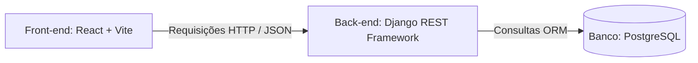

# DOCUMENTAÇÃO COMPLETA: SISTEMA DE GESTÃO DE TCC (BANCAS DE DEFESA) - IFAM

Este documento reúne todas as informações técnicas, estruturais, conceituais e o código fonte comentado de forma 100% unificada. É o guia definitivo do projeto para apresentação acadêmica, desenvolvimento e implantação.

---

## 📋 SEÇÃO 1: CONTEXTO E FLUXO DE EXECUÇÃO DO PROJETO

### 1.1 Visão Geral do Sistema
*   **Instituição:** Instituto Federal do Amazonas (IFAM) - Campus Manaus Zona Leste.
*   **Finalidade:** Interface acadêmica para agendamento de bancas de defesa de TCC (Trabalhos de Conclusão de Curso). O sistema permite visualizar bancas cadastradas, registrar novas defesas (com ID do Tema de TCC, datas/horas de início e fim, e local ou link) e realizar cancelamentos.
*   **Restrições e Condições de Laboratório (Faculdade):**
    *   O computador de destino (faculdade) roda Windows, com **Python 3.10.11** e **PostgreSQL**.
    *   **Sem privilégios de administrador** (bloqueio do PowerShell para scripts `.ps1`).
    *   **Sem Node.js/npm** instalados no laboratório local.
    *   **Sem internet de alta velocidade** (necessidade de dependências instaladas em venv local e frontend pré-compilado na pasta `/frontend/dist`).

---

## ⚙️ SEÇÃO 2: GUIA DE TECNOLOGIAS ADOTADAS (STACK)

O projeto utiliza uma arquitetura descentralizada (decoupled), na qual o **Front-end** e o **Back-end** são totalmente separados, comunicando-se exclusivamente através de requisições HTTP (API REST) e troca de dados no formato **JSON**.



### 2.1 Tecnologias do Front-end

#### **React**
*   **O que é:** Biblioteca JavaScript declarativa baseada em componentes para a construção de interfaces de usuário.
*   **Motivos da Escolha:**
    *   **Componentização:** Permite dividir a tela em pedaços isolados e reutilizáveis (botão de cancelar, cabeçalho do IFAM, cards, formulário), facilitando a colaboração simultânea dos membros da equipe.
    *   **Estado Declarativo (Hooks):** Hooks como `useState` e `useEffect` permitem que a tela reaja automaticamente a alterações de dados sem necessidade de manipulação direta do DOM.
    *   **Virtual DOM:** Garante performance otimizada, atualizando em tela apenas os elementos cujo estado foi alterado.

#### **Vite**
*   **O que é:** Ferramenta de build rápida para empacotamento e desenvolvimento front-end moderno.
*   **Motivos da Escolha:**
    *   **HMR (Hot Module Replacement):** Atualizações instantâneas no navegador durante o desenvolvimento sem perda do estado interno.
    *   **Otimização do Build:** Compilação automatizada dos arquivos React para arquivos estáticos (`index.html`, JS e CSS minificados) dentro do diretório `frontend/dist/`, permitindo rodar a interface usando apenas servidores web estáticos simples (como o módulo nativo do Python).

#### **React Router DOM**
*   **O que é:** A biblioteca padrão para gerenciamento de navegação e rotas dinâmicas em aplicações React.
*   **Motivos da Escolha:**
    *   **SPA (Single Page Application):** Evita recarregamentos completos da página no navegador, proporcionando transições fluidas e experiência de aplicação nativa de desktop.

#### **Axios**
*   **O que é:** Um cliente HTTP baseado em Promessas (Promises) para fazer requisições à API.
*   **Motivos da Escolha:**
    *   **Interceptadores de Requisição:** Configura dinamicamente tokens de autenticação (`Bearer token`) nos cabeçalhos de todas as requisições.
    *   **Tratamento Centralizado de Erros e JSON:** Converte respostas e envia dados JSON de forma nativa e automática.

### 2.2 Tecnologias do Back-end

#### **Django & Django REST Framework (DRF)**
*   **O que é:** Django é um framework Python de alto nível para desenvolvimento web ágil e seguro; o DRF é um toolkit poderoso para construção de APIs RESTful.
*   **Motivos da Escolha:**
    *   **Batteries-Included:** Disponibiliza ferramentas prontas para autenticação, administração (Django Admin) e segurança integrada (proteção nativa contra SQL Injection, CSRF, etc.).
    *   **Serializers:** Facilidade na conversão de tipos complexos (como models) para JSON e validação estruturada e segura de dados.
    *   **Django ORM:** Camada de abstração do banco de dados que permite interagir com tabelas por meio de classes Python.

#### **Simple JWT (Autenticação JSON Web Token)**
*   **O que é:** Mecanismo de autenticação de chaves sem estado (stateless) para APIs web.
*   **Motivos da Escolha:**
    *   Dispensa o armazenamento de sessões no servidor de banco de dados. Os tokens contêm as credenciais do usuário criptografadas, sendo renovadas periodicamente.

#### **Django CORS Headers**
*   **O que é:** Middleware para gerenciamento de CORS (Cross-Origin Resource Sharing).
*   **Motivos da Escolha:**
    *   Permite a comunicação segura entre o frontend que roda em um domínio/porta (`http://localhost:5173`) e o backend em outro (`http://127.0.0.1:8000`).

### 2.3 Banco de Dados

#### **PostgreSQL**
*   **O que é:** Sistema gerenciador de banco de dados relacional de código aberto, robusto e extensível.
*   **Motivos da Escolha:**
    *   **Confiabilidade (Transações ACID):** Garante integridade absoluta dos dados acadêmicos.
    *   **Uso de UUIDs:** Suporte nativo ao tipo UUID para identificação exclusiva de registros sem expor IDs sequenciais nas URLs públicas do sistema.

---

## 🏛️ SEÇÃO 3: ARQUITETURA, POO E DESIGN PATTERNS APLICADOS

### 3.1 Arquitetura de Software

*   **Arquitetura Decoupled (Cliente-Servidor):** Total separação de responsabilidades. O Frontend se preocupa com a experiência visual e a acessibilidade, enquanto o Backend executa regras de negócio, persistência e validação.
*   **Arquitetura RESTful:** Comunicação sem estado baseada em recursos HTTP mapeados por métodos padronizados (GET para consultas, POST para criação, PATCH para atualizações parciais, DELETE para remoções).
*   **Componentização e Estado Reativo (Frontend):** Layout dividido em blocos de componentes independentes e reativos que observam modificações em variáveis de estado.

### 3.2 Programação Orientada a Objetos (POO) no Backend

*   **Herança (Inheritance):** 
    *   A classe `AgendamentoBanca` herda de `models.Model` do Django, herdando automaticamente métodos complexos de persistência (`.save()`, `.delete()`) e gerenciamento de queries (`.objects`).
    *   A view `AgendamentoBancaViewSet` herda de `viewsets.ModelViewSet`, adquirindo a implementação completa das cinco operações do padrão CRUD por herança.
*   **Polimorfismo (Polymorphism):**
    *   Sobrescrita de métodos (**Method Overriding**). Exemplo: implementação customizada de `__str__(self)` nas classes de modelo e do método `clean(self)` para adicionar regras personalizadas de colisão de salas adicionadas ao ciclo de validação padrão do framework.
*   **Encapsulamento (Encapsulation):**
    *   Uso do ORM do Django. Os comandos SQL puros são encapsulados por completo. Desenvolvedores interagem com objetos e métodos Python seguros, mantendo o banco de dados isolado de manipulações manuais diretas.

### 3.3 Padrões de Projeto (Design Patterns)

*   **Active Record (Padrão de ORM):**
    *   Uma tabela no banco de dados é representada diretamente por uma classe (Model) e cada linha da tabela corresponde a uma instância deste objeto. Os dados e os comportamentos de persistência residem na mesma estrutura.
*   **Facade (Fachada):**
    *   Implementado na camada de serviços do frontend (`agendamentoBanca.service.js`). A página de interface (`AgendamentoBancaPage.jsx`) não interage diretamente com chamadas HTTP complexas do Axios, cabeçalhos ou endpoints específicos. Ela apenas invoca funções simplificadas como `criarAgendamento(payload)` que ocultam essa complexidade.
*   **Singleton (Instância Única):**
    *   Implementado no arquivo de conexão `api.js`. Garante que apenas uma instância única do cliente Axios seja instanciada para toda a aplicação, concentrando a URL base, timeout e interceptadores de requisição em uma conexão única.
*   **Observer / Reactor (Padrão Reativo):**
    *   Utilizado pelo motor do React (`useState` e `useEffect`). Elementos visuais agem como observadores de variáveis de estado. Ao invocar modificadores de estado, o motor detecta a alteração e atualiza automaticamente os elementos visuais vinculados sem intervenção direta do desenvolvedor no DOM HTML.

---

## 🐍 SEÇÃO 4: CÓDIGO FONTE COMENTADO DO BACKEND (PYTHON / DJANGO)

### 4.1 Modelos do Banco de Dados (`gestao_tcc/models.py`)

```python
import uuid
from django.core.exceptions import ValidationError
from django.db import models
from django.db.models import F, Q

# -------------------------------------------------------------------
# MODELO ALUNO
# -------------------------------------------------------------------
class Aluno(models.Model):
    # UUIDField garante chaves primárias alfanuméricas aleatórias para evitar adivinhação de IDs por terceiros.
    id = models.UUIDField(primary_key=True, default=uuid.uuid4, editable=False)
    nome_completo = models.CharField(max_length=150)
    # unique=True impede duplicidade de registros de matrículas ou e-mails no banco de dados.
    matricula = models.CharField(max_length=20, unique=True)
    email = models.EmailField(max_length=100, unique=True)
    senha_hash = models.CharField(max_length=255)
    curso = models.CharField(max_length=100)

    class Meta:
        db_table = "aluno"  # Nome exato da tabela criada no PostgreSQL/SQLite
        ordering = ["nome_completo"]  # Ordena automaticamente buscas de registros por ordem alfabética

    def __str__(self):
        # Exibição textual amigável do objeto, útil para o console e o painel administrativo do Django.
        return self.nome_completo


# -------------------------------------------------------------------
# MODELO TEMA DE TCC
# -------------------------------------------------------------------
class TemaTcc(models.Model):
    # Constantes estáticas para representação de estados de aprovação.
    STATUS_PENDENTE = "Pendente"
    STATUS_APROVADO = "Aprovado"
    STATUS_REJEITADO = "Rejeitado"

    STATUS_CHOICES = [
        (STATUS_PENDENTE, "Pendente"),
        (STATUS_APROVADO, "Aprovado"),
        (STATUS_REJEITADO, "Rejeitado"),
    ]

    id = models.UUIDField(primary_key=True, default=uuid.uuid4, editable=False)
    # ForeignKey representa um relacionamento 1-para-N (um aluno pode ter vários temas de TCC).
    # models.CASCADE: apaga todos os temas atrelados se o registro do aluno correspondente for excluído.
    aluno = models.ForeignKey(Aluno, on_delete=models.CASCADE, related_name="temas_tcc")
    titulo = models.CharField(max_length=255)
    resumo = models.TextField()
    status = models.CharField(
        max_length=30,
        choices=STATUS_CHOICES,
        default=STATUS_PENDENTE,
    )
    # auto_now_add=True captura automaticamente o momento exato do registro na criação.
    data_submissao = models.DateTimeField(auto_now_add=True)

    class Meta:
        db_table = "tema_tcc"
        ordering = ["-data_submissao"]  # Ordenação decrescente (da submissão mais recente para a mais antiga)

    def __str__(self):
        return self.titulo


# -------------------------------------------------------------------
# MODELO VERSÃO TRABALHO
# -------------------------------------------------------------------
class VersaoTrabalho(models.Model):
    id = models.UUIDField(primary_key=True, default=uuid.uuid4, editable=False)
    tema_tcc = models.ForeignKey(TemaTcc, on_delete=models.CASCADE, related_name="versoes_trabalho")
    arquivo_url = models.CharField(max_length=255)
    versao = models.IntegerField(default=1)
    data_envio = models.DateTimeField(auto_now_add=True)

    class Meta:
        db_table = "versao_trabalho"
        ordering = ["-data_envio"]

    def __str__(self):
        return f"{self.tema_tcc.titulo} - V{self.versao}"


# -------------------------------------------------------------------
# MODELO PARECER ORIENTADOR
# -------------------------------------------------------------------
class ParecerOrientador(models.Model):
    id = models.UUIDField(primary_key=True, default=uuid.uuid4, editable=False)
    versao = models.ForeignKey(VersaoTrabalho, on_delete=models.CASCADE, related_name="pareceres")
    comentario = models.TextField()
    apto_banca = models.BooleanField(default=False)
    data_parecer = models.DateTimeField(auto_now_add=True)

    class Meta:
        db_table = "parecer_orientador"

    def __str__(self):
        return f"Parecer sobre V{self.versao.versao}: {'Apto' if self.apto_banca else 'Inapto'}"


# -------------------------------------------------------------------
# MODELO AGENDAMENTO DE BANCA
# -------------------------------------------------------------------
class AgendamentoBanca(models.Model):
    id = models.UUIDField(primary_key=True, default=uuid.uuid4, editable=False)
    
    # OneToOneField: Garante relacionamento 1-para-1 (cada tema de TCC possui exclusivamente um agendamento de banca).
    # models.PROTECT: Impede a exclusão acidental de um tema de TCC se houver uma banca agendada para ele.
    tema_tcc = models.OneToOneField(
        TemaTcc,
        on_delete=models.PROTECT,
        related_name="agendamento_banca",
    )
    data_hora_inicio = models.DateTimeField()
    data_hora_fim = models.DateTimeField()
    local_ou_link = models.CharField(max_length=255)

    class Meta:
        db_table = "agendamento_banca"
        ordering = ["data_hora_inicio"]
        # Índices aceleram a velocidade de consultas SQL executadas pelo ORM em campos filtrados constantemente.
        indexes = [
            models.Index(fields=["local_ou_link", "data_hora_inicio", "data_hora_fim"]),
            models.Index(fields=["data_hora_inicio"]),
        ]
        # CheckConstraints garantem travas a nível de banco de dados (ex: impede data final anterior à inicial).
        constraints = [
            models.CheckConstraint(
                condition=Q(data_hora_fim__gt=F("data_hora_inicio")),
                name="agendamento_banca_fim_apos_inicio",
            ),
        ]

    def clean(self):
        """
        Executa as validações lógicas e regras de negócio antes dos dados serem salvos no banco.
        """
        super().clean()  # Chama as validações padrão do Django

        if self.data_hora_inicio and self.data_hora_fim:
            # Validação 1: Bloqueia caso o término da banca ocorra antes ou no exato instante do início.
            if self.data_hora_fim <= self.data_hora_inicio:
                raise ValidationError(
                    {"data_hora_fim": "A data/hora final deve ser posterior ao inicio."}
                )

            # Validação 2: Verificação de sobreposição/conflito de salas ou links no mesmo horário.
            # Localiza agendamentos no banco com o mesmo local/link (sem diferenciar maiúsculas/minúsculas)
            # onde a janela de tempo se sobreponha (início menor que o nosso fim E término maior que o nosso início).
            conflito = AgendamentoBanca.objects.filter(
                local_ou_link__iexact=self.local_ou_link.strip(),
                data_hora_inicio__lt=self.data_hora_fim,
                data_hora_fim__gt=self.data_hora_inicio,
            )

            # Se for uma atualização (objeto já existente), exclui ele mesmo da consulta de colisão de horários.
            if self.pk:
                conflito = conflito.exclude(pk=self.pk)

            # Caso haja registros na lista retornada, levanta um erro de validação.
            if conflito.exists():
                raise ValidationError(
                    {
                        "local_ou_link": (
                            "Ja existe uma banca agendada neste local/link "
                            "com horario sobreposto."
                        )
                    }
                )

    def __str__(self):
        return f"{self.tema_tcc_id} - {self.local_ou_link} - {self.data_hora_inicio}"
```

### 4.2 Serializadores da API (`gestao_tcc/serializers.py`)

```python
from rest_framework import serializers
from .models import AgendamentoBanca, ParecerOrientador, TemaTcc

class AgendamentoBancaSerializer(serializers.ModelSerializer):
    # Vincula o campo recebido "tema_tcc_id" à query de busca de objetos no modelo TemaTcc.
    tema_tcc_id = serializers.PrimaryKeyRelatedField(
        queryset=TemaTcc.objects.all(),
        source="tema_tcc",
    )

    class Meta:
        model = AgendamentoBanca
        fields = [
            "id",
            "tema_tcc_id",
            "data_hora_inicio",
            "data_hora_fim",
            "local_ou_link",
        ]
        # read_only_fields: impede o frontend de tentar definir ou alterar o ID UUID que é controlado pelo servidor.
        read_only_fields = ["id"]

    def validate_local_ou_link(self, value):
        # Remove espaços desnecessários nas pontas do texto de entrada.
        local = value.strip()
        if not local:
            raise serializers.ValidationError("Informe a sala fisica ou link da banca.")
        return local

    def validate(self, attrs):
        """
        Validações estruturais e de integridade lógica executadas durante a conversão do JSON para objeto Python.
        """
        instance = self.instance  # Pega o registro atual caso seja uma edição (PATCH/PUT)

        # Captura os dados novos do payload JSON ou mantém os atuais se o campo não foi modificado.
        tema_tcc = attrs.get("tema_tcc", getattr(instance, "tema_tcc", None))
        data_hora_inicio = attrs.get("data_hora_inicio", getattr(instance, "data_hora_inicio", None))
        data_hora_fim = attrs.get("data_hora_fim", getattr(instance, "data_hora_fim", None))
        local_ou_link = attrs.get("local_ou_link", getattr(instance, "local_ou_link", ""))

        # 1. Validação temporal.
        if data_hora_inicio and data_hora_fim and data_hora_fim <= data_hora_inicio:
            raise serializers.ValidationError({"data_hora_fim": "A data/hora final deve ser posterior ao inicio."})

        # 2. Regra de Negócio: Somente temas com Parecer Favorável dos orientadores ("Apto") podem ter banca agendada.
        if tema_tcc and not self._tema_tem_parecer_favoravel(tema_tcc):
            raise serializers.ValidationError(
                {"tema_tcc_id": "So e possivel agendar banca para tema com parecer favoravel do orientador."}
            )

        # 3. Validação de colisão de salas.
        if data_hora_inicio and data_hora_fim and local_ou_link:
            conflito = AgendamentoBanca.objects.filter(
                local_ou_link__iexact=local_ou_link.strip(),
                data_hora_inicio__lt=data_hora_fim,
                data_hora_fim__gt=data_hora_inicio,
            )
            if instance:
                conflito = conflito.exclude(pk=instance.pk)
            if conflito.exists():
                raise serializers.ValidationError(
                    {"local_ou_link": "Ja existe uma banca agendada neste local/link com horario sobreposto."}
                )

        return attrs

    def _tema_tem_parecer_favoravel(self, tema_tcc):
        """
        Método auxiliar privado. Verifica na tabela ParecerOrientador se há pareceres favoráveis ("apto_banca=True") 
        relacionados a versões do TCC em análise.
        """
        return ParecerOrientador.objects.filter(
            versao__tema_tcc=tema_tcc,
            apto_banca=True,
        ).exists()
```

### 4.3 Controladores / Views (`gestao_tcc/views.py`)

```python
from django.db import transaction
from rest_framework import viewsets
from rest_framework.permissions import AllowAny

from .models import AgendamentoBanca
from .serializers import AgendamentoBancaSerializer

# viewsets.ModelViewSet fornece automaticamente as implementações padrão das rotas CRUD (listar, criar, atualizar, deletar).
class AgendamentoBancaViewSet(viewsets.ModelViewSet):
    serializer_class = AgendamentoBancaSerializer
    permission_classes = [AllowAny]  # Configurado com acesso público por padrão para apresentações locais.

    def get_queryset(self):
        """
        Filtra e retorna os registros de bancas cadastrados conforme parâmetros enviados nas query strings da URL.
        """
        # select_related realiza uma junção SQL (JOIN) na tabela TemaTcc reduzindo o número de consultas adicionais no banco.
        queryset = AgendamentoBanca.objects.select_related("tema_tcc").all()

        # Captura filtros informados nas URLs, se existirem (ex: /api/bancas/agendamento/?local=Sala 301)
        tema_tcc_id = self.request.query_params.get("tema_tcc_id")
        local = self.request.query_params.get("local")
        data_inicio = self.request.query_params.get("data_inicio")
        data_fim = self.request.query_params.get("data_fim")

        # Filtros dinâmicos aplicados na query.
        if tema_tcc_id:
            queryset = queryset.filter(tema_tcc_id=tema_tcc_id)

        if local:
            # icontains procura a substring de forma case-insensitive (ignora maiúsculas e minúsculas).
            queryset = queryset.filter(local_ou_link__icontains=local)

        if data_inicio:
            # gte (Greater Than or Equal): data de início maior ou igual ao parâmetro informado.
            queryset = queryset.filter(data_hora_inicio__gte=data_inicio)

        if data_fim:
            # lte (Less Than or Equal): data de início menor ou igual ao parâmetro informado.
            queryset = queryset.filter(data_hora_inicio__lte=data_fim)

        return queryset

    # @transaction.atomic: Garante atomicidade da transação. Se algo der errado no salvamento, 
    # o banco de dados executa um rollback automático prevenindo dados parciais corrompidos.
    @transaction.atomic
    def perform_create(self, serializer):
        serializer.save()

    @transaction.atomic
    def perform_update(self, serializer):
        serializer.save()
```

### 4.4 Roteador de URLs do Backend (`gestao_tcc/urls.py`)

```python
from django.urls import include, path
from rest_framework.routers import DefaultRouter
from .views import AgendamentoBancaViewSet

# DefaultRouter gera automaticamente os caminhos de URL HTTP da API para as Views.
# Exemplos mapeados:
# GET /api/bancas/agendamento/ -> Lista os agendamentos.
# POST /api/bancas/agendamento/ -> Cadastra novo agendamento.
# DELETE /api/bancas/agendamento/<id>/ -> Deleta agendamento pelo ID.
router = DefaultRouter()
router.register(
    r"bancas/agendamento",
    AgendamentoBancaViewSet,
    basename="agendamento-banca",
)

urlpatterns = [
    path("", include(router.urls)),
]
```

---

## ⚛️ SEÇÃO 5: CÓDIGO FONTE COMENTADO DO FRONTEND (REACT / AXIOS)

### 5.1 Instância de Integração HTTP (`frontend/src/services/api.js`)

```javascript
import axios from 'axios'

// Configura uma instância centralizada (Padrão Singleton) do cliente de conexão HTTP.
const api = axios.create({
  baseURL: 'http://127.0.0.1:8000/api/', // Aponta para a porta padrão configurada no servidor Django local.
})

// Interceptador configurado nas requisições. 
// Examina se existe um token de login no armazenamento do navegador e insere automaticamente no cabeçalho Authorization.
api.interceptors.request.use(async (config) => {
  const token = localStorage.getItem('access_token')
  if (token) {
    config.headers.Authorization = `Bearer ${token}`
  }
  return config
})

export default api
```

### 5.2 Camada de Serviços do Agendamento (`frontend/src/services/agendamentoBanca.service.js`)

```javascript
import api from './api'

// Define o endpoint relativo do recurso no backend.
const RESOURCE = 'bancas/agendamento/'

// Busca todas as bancas enviando parâmetros opcionais de filtro na URL.
export async function listarAgendamentos(params = {}) {
  const { data } = await api.get(RESOURCE, { params })
  return data
}

// Registra um novo agendamento enviando os dados informados em JSON no corpo da requisição POST.
export async function criarAgendamento(payload) {
  const { data } = await api.post(RESOURCE, payload)
  return data
}

// Atualiza parcialmente informações de agendamentos pelo ID utilizando chamadas parciais PATCH.
export async function atualizarAgendamento(id, payload) {
  const { data } = await api.patch(`${RESOURCE}${id}/`, payload)
  return data
}

// Remove o registro de agendamento do banco de dados disparando método DELETE no endpoint correspondente.
export async function cancelarAgendamento(id) {
  await api.delete(`${RESOURCE}${id}/`)
}
```

### 5.3 Interface do Usuário (`frontend/src/pages/AgendamentoBancaPage.jsx`)

```jsx
import { useEffect, useMemo, useRef, useState } from 'react'

import {
  cancelarAgendamento,
  criarAgendamento,
  listarAgendamentos,
} from '../services/agendamentoBanca.service'
import './AgendamentoBancaPage.css'

const initialForm = {
  tema_tcc_id: '',
  data_hora_inicio: '',
  data_hora_fim: '',
  local_ou_link: 'Sala 301',
}

function formatDateTime(value) {
  if (!value) return '-'
  return new Intl.DateTimeFormat('pt-BR', {
    dateStyle: 'short',
    timeStyle: 'short',
  }).format(new Date(value))
}

function getLocalISOString(date = new Date()) {
  const tzoffset = date.getTimezoneOffset() * 60000
  return new Date(date.getTime() - tzoffset).toISOString().slice(0, 16)
}

function getApiError(error) {
  const detail = error?.response?.data

  if (!detail) {
    return 'Não foi possível conectar com a API.'
  }

  if (typeof detail === 'string') {
    if (detail.trim().startsWith('<!DOCTYPE') || detail.includes('<html') || detail.includes('Django')) {
      return 'Erro interno do servidor. O tema informado pode já ter uma banca agendada ou ocorreu um conflito de dados no banco.'
    }
    return detail
  }

  if (detail.detail) {
    return detail.detail
  }

  return Object.entries(detail)
    .map(([field, messages]) => {
      const text = Array.isArray(messages) ? messages.join(' ') : messages
      return `${field}: ${text}`
    })
    .join(' ')
}

function InstitutoFederalLogo() {
  const moduleSize = 20
  const gap = moduleSize * 0.2
  const radius = moduleSize * 0.1
  const circleRadius = moduleSize * 0.55

  return (
    <svg
      className="ifam-logo-svg"
      viewBox="0 0 360 128"
      width="360"
      height="128"
      role="img"
      aria-labelledby="ifam-logo-title"
    >
      <title id="ifam-logo-title">Instituto Federal Amazonas - Campus Manaus Zona Leste</title>
      <g transform="translate(12, 12)">
        <circle cx={moduleSize / 2} cy={moduleSize / 2} r={circleRadius} fill="#cd191e" />
        <rect x="0" y={moduleSize + gap} width={moduleSize} height={moduleSize} fill="#2f9e41" rx={radius} />
        <rect x="0" y={(moduleSize + gap) * 2} width={moduleSize} height={moduleSize} fill="#2f9e41" rx={radius} />
        <rect x="0" y={(moduleSize + gap) * 3} width={moduleSize} height={moduleSize} fill="#2f9e41" rx={radius} />

        <rect x={moduleSize + gap} y="0" width={moduleSize} height={moduleSize} fill="#2f9e41" rx={radius} />
        <rect x={moduleSize + gap} y={moduleSize + gap} width={moduleSize} height={moduleSize} fill="#2f9e41" rx={radius} />
        <rect x={moduleSize + gap} y={(moduleSize + gap) * 2} width={moduleSize} height={moduleSize} fill="#2f9e41" rx={radius} />
        <rect x={moduleSize + gap} y={(moduleSize + gap) * 3} width={moduleSize} height={moduleSize} fill="#2f9e41" rx={radius} />

        <rect x={(moduleSize + gap) * 2} y="0" width={moduleSize} height={moduleSize} fill="#2f9e41" rx={radius} />
        <rect x={(moduleSize + gap) * 2} y={(moduleSize + gap) * 2} width={moduleSize} height={moduleSize} fill="#2f9e41" rx={radius} />
      </g>

      <g className="ifam-logo-lettering" transform="translate(104, 20)">
        <text x="0" y="22" className="ifam-logo-title-line">INSTITUTO</text>
        <text x="0" y="46" className="ifam-logo-title-line">FEDERAL</text>
        <text x="0" y="68" className="ifam-logo-institute">Amazonas</text>
        <line x1="0" y1="80" x2="178" y2="80" className="ifam-logo-divider" />
        <text x="0" y="102" className="ifam-logo-campus">Campus Manaus Zona Leste</text>
      </g>
    </svg>
  )
}

export default function AgendamentoBancaPage() {
  const [form, setForm] = useState(initialForm)
  const [agendamentos, setAgendamentos] = useState([])
  const [loading, setLoading] = useState(false)
  const [saving, setSaving] = useState(false)
  const [formError, setFormError] = useState('')
  const [formSuccess, setFormSuccess] = useState('')
  const [listError, setListError] = useState('')
  const [listSuccess, setListSuccess] = useState('')
  const [confirmDeleteId, setConfirmDeleteId] = useState(null)
  const [cancellingId, setCancellingId] = useState(null)

  // Estados extras de UI
  const [toasts, setToasts] = useState([])
  const [helpOpen, setHelpOpen] = useState(false)
  const [localOption, setLocalOption] = useState('Sala 301')
  const toastIdRef = useRef(0)

  // Estados para busca e filtragem
  const [filterTema, setFilterTema] = useState('')
  const [filterDataInicio, setFilterDataInicio] = useState('')
  const [filterDataFim, setFilterDataFim] = useState('')

  // Estados para o calendário
  const [calendarDate, setCalendarDate] = useState(new Date())
  const [selectedCalendarDay, setSelectedCalendarDay] = useState(null)

  const minInicio = useMemo(() => getLocalISOString(), [])

  // Auxiliar para adicionar Toasts
  const addToast = (message, type = 'success') => {
    toastIdRef.current += 1
    const id = toastIdRef.current
    setToasts((prev) => [...prev, { id, message, type }])
    setTimeout(() => {
      setToasts((prev) => prev.filter((t) => t.id !== id))
    }, 4000)
  }

  function handleLocalOptionChange(event) {
    const nextLocalOption = event.target.value
    setLocalOption(nextLocalOption)
    setForm((current) => ({
      ...current,
      local_ou_link: nextLocalOption === 'custom' ? '' : nextLocalOption,
    }))
  }

  // Estatísticas do portal
  const stats = useMemo(() => {
    const total = agendamentos.length
    const now = new Date()
    const futureAgendamentos = agendamentos
      .filter((item) => new Date(item.data_hora_inicio) > now)
      .sort((a, b) => new Date(a.data_hora_inicio) - new Date(b.data_hora_inicio))
    
    const proximaBanca = futureAgendamentos.length > 0 
      ? formatDateTime(futureAgendamentos[0].data_hora_inicio)
      : 'Nenhuma agendada'
      
    let presencial = 0
    let online = 0
    agendamentos.forEach((item) => {
      const loc = item.local_ou_link.toLowerCase()
      if (loc.includes('sala')) {
        presencial++
      } else if (loc.startsWith('http') || loc.includes('meet') || loc.includes('zoom') || loc.includes('link')) {
        online++
      } else {
        presencial++
      }
    })
    
    return { total, proximaBanca, presencial, online }
  }, [agendamentos])

  // Validação em tempo real: avisar se a data final <= data inicial
  const showDateWarning = useMemo(() => {
    return form.data_hora_inicio && form.data_hora_fim && new Date(form.data_hora_fim) <= new Date(form.data_hora_inicio)
  }, [form.data_hora_inicio, form.data_hora_fim])

  // Validação em tempo real: detectar conflito local de sala na listagem
  const localConflict = useMemo(() => {
    if (!form.data_hora_inicio || !form.data_hora_fim || !form.local_ou_link) return null
    const start = new Date(form.data_hora_inicio)
    const end = new Date(form.data_hora_fim)
    if (end <= start) return null
    
    const overlap = agendamentos.find((item) => {
      const itemStart = new Date(item.data_hora_inicio)
      const itemEnd = new Date(item.data_hora_fim)
      const sameLocal = item.local_ou_link.trim().toLowerCase() === form.local_ou_link.trim().toLowerCase()
      return sameLocal && itemStart < end && itemEnd > start
    })
    return overlap || null
  }, [form.data_hora_inicio, form.data_hora_fim, form.local_ou_link, agendamentos])

  // Identifica todos os conflitos gerais da tabela (bancas sobrepostas)
  const conflictsSet = useMemo(() => {
    const conflicts = new Set()
    for (let i = 0; i < agendamentos.length; i++) {
      for (let j = i + 1; j < agendamentos.length; j++) {
        const a = agendamentos[i]
        const b = agendamentos[j]
        if (a.local_ou_link.trim().toLowerCase() === b.local_ou_link.trim().toLowerCase()) {
          const aStart = new Date(a.data_hora_inicio)
          const aEnd = new Date(a.data_hora_fim)
          const bStart = new Date(b.data_hora_inicio)
          const bEnd = new Date(b.data_hora_fim)
          if (aStart < bEnd && bStart < aEnd) {
            conflicts.add(a.id)
            conflicts.add(b.id)
          }
        }
      }
    }
    return conflicts
  }, [agendamentos])

  const sortedAgendamentos = useMemo(() => {
    return [...agendamentos].sort(
      (a, b) => new Date(a.data_hora_inicio) - new Date(b.data_hora_inicio),
    )
  }, [agendamentos])

  const filteredAgendamentos = useMemo(() => {
    return sortedAgendamentos.filter((item) => {
      // Filtrar por tema ou local (busca por texto parcial, case-insensitive)
      if (filterTema) {
        const query = filterTema.toLowerCase()
        const matchTema = item.tema_tcc_id && String(item.tema_tcc_id).toLowerCase().includes(query)
        const matchLocal = item.local_ou_link && String(item.local_ou_link).toLowerCase().includes(query)
        if (!matchTema && !matchLocal) return false
      }

      // Filtrar por período inicial
      if (filterDataInicio) {
        const startLimit = new Date(filterDataInicio)
        const itemStart = new Date(item.data_hora_inicio)
        if (itemStart < startLimit) return false
      }

      // Filtrar por período final
      if (filterDataFim) {
        const endLimit = new Date(filterDataFim)
        const itemStart = new Date(item.data_hora_inicio)
        if (itemStart > endLimit) return false
      }

      return true
    })
  }, [sortedAgendamentos, filterTema, filterDataInicio, filterDataFim])

  // --- LÓGICA DO CALENDÁRIO MENSUAL ---
  const monthNames = useMemo(() => [
    "Janeiro", "Fevereiro", "Março", "Abril", "Maio", "Junho",
    "Julho", "Agosto", "Setembro", "Outubro", "Novembro", "Dezembro"
  ], [])

  const daysOfWeek = useMemo(() => ["Dom", "Seg", "Ter", "Qua", "Qui", "Sex", "Sáb"], [])

  const yearsRange = useMemo(() => {
    const currentYear = new Date().getFullYear()
    const range = []
    for (let y = currentYear - 5; y <= currentYear + 5; y++) {
      range.push(y)
    }
    return range
  }, [])

  const year = calendarDate.getFullYear()
  const month = calendarDate.getMonth()

  // Filtra as bancas exibidas na tabela com base no dia selecionado no calendário
  const finalFilteredBancas = useMemo(() => {
    if (selectedCalendarDay === null) return filteredAgendamentos
    return filteredAgendamentos.filter((item) => {
      const itemDate = new Date(item.data_hora_inicio)
      return (
        itemDate.getDate() === selectedCalendarDay &&
        itemDate.getMonth() === month &&
        itemDate.getFullYear() === year
      )
    })
  }, [filteredAgendamentos, selectedCalendarDay, month, year])

  // Gera as células correspondentes ao grid mensal do calendário (42 células)
  const calendarCells = useMemo(() => {
    const cells = []
    const firstDayIndex = new Date(year, month, 1).getDay()
    const totalDays = new Date(year, month + 1, 0).getDate()
    const prevTotalDays = new Date(year, month, 0).getDate()

    // Dias do mês anterior (padding esquerdo)
    for (let i = firstDayIndex - 1; i >= 0; i--) {
      cells.push({
        day: prevTotalDays - i,
        isCurrentMonth: false,
        monthOffset: -1
      })
    }

    // Dias do mês atual
    for (let i = 1; i <= totalDays; i++) {
      cells.push({
        day: i,
        isCurrentMonth: true,
        monthOffset: 0
      })
    }

    // Dias do próximo mês (padding direito para completar 42 células)
    const remainingSlots = 42 - cells.length
    for (let i = 1; i <= remainingSlots; i++) {
      cells.push({
        day: i,
        isCurrentMonth: false,
        monthOffset: 1
      })
    }

    return cells
  }, [year, month])

  const prevMonth = () => {
    setCalendarDate(new Date(year, month - 1, 1))
    setSelectedCalendarDay(null)
  }

  const nextMonth = () => {
    setCalendarDate(new Date(year, month + 1, 1))
    setSelectedCalendarDay(null)
  }

  const prevYear = () => {
    setCalendarDate(new Date(year - 1, month, 1))
    setSelectedCalendarDay(null)
  }

  const nextYear = () => {
    setCalendarDate(new Date(year + 1, month, 1))
    setSelectedCalendarDay(null)
  }

  const handleDayClick = (cell) => {
    if (!cell.isCurrentMonth) return
    if (selectedCalendarDay === cell.day) {
      setSelectedCalendarDay(null)
    } else {
      setSelectedCalendarDay(cell.day)
    }
  }

  async function carregarAgendamentos() {
    setLoading(true)
    setListError('')

    try {
      const data = await listarAgendamentos()
      setAgendamentos(Array.isArray(data) ? data : data.results || [])
    } catch (err) {
      setListError(getApiError(err))
    } finally {
      setLoading(false)
    }
  }

  useEffect(() => {
    // Carrega dados assincronamente para evitar chamadas síncronas de setState no corpo do effect
    Promise.resolve().then(() => {
      carregarAgendamentos()
    })
  }, [])

  useEffect(() => {
    if (formSuccess) {
      const t = setTimeout(() => setFormSuccess(''), 4000)
      return () => clearTimeout(t)
    }
  }, [formSuccess])

  useEffect(() => {
    if (listSuccess) {
      const t = setTimeout(() => setListSuccess(''), 4000)
      return () => clearTimeout(t)
    }
  }, [listSuccess])

  function handleChange(event) {
    const { name, value } = event.target
    setForm((current) => ({ ...current, [name]: value }))
  }

  // Atalhos Rápidos de data
  const handleQuickDate = (type) => {
    const start = new Date()
    start.setMinutes(0, 0, 0)
    if (type === 'hoje') {
      start.setHours(start.getHours() + 1)
    } else if (type === 'amanha') {
      start.setDate(start.getDate() + 1)
      start.setHours(14)
    } else if (type === 'proxima-semana') {
      const day = start.getDay()
      const daysToAdd = day === 0 ? 1 : 8 - day
      start.setDate(start.getDate() + daysToAdd)
      start.setHours(14)
    }
    const end = new Date(start.getTime() + 60 * 60 * 1000) // 1 hora de duração
    setForm((current) => ({
      ...current,
      data_hora_inicio: getLocalISOString(start),
      data_hora_fim: getLocalISOString(end),
    }))
  }

  async function handleSubmit(event) {
    event.preventDefault()
    setSaving(true)
    setFormError('')
    setFormSuccess('')

    if (new Date(form.data_hora_inicio) >= new Date(form.data_hora_fim)) {
      setFormError('A data de fim deve ser posterior à data de início.')
      addToast('A data de fim deve ser posterior à data de início.', 'error')
      setSaving(false)
      return
    }

    // Validação preventiva: impede envio caso o UUID do tema já tenha banca cadastrada na listagem local
    const jaAgendado = agendamentos.some(
      (item) => String(item.tema_tcc_id).trim().toLowerCase() === String(form.tema_tcc_id).trim().toLowerCase()
    )
    if (jaAgendado) {
      setFormError('Este tema de TCC já possui uma banca agendada. Cada tema só pode ter uma única banca.')
      addToast('Este tema de TCC já possui uma banca agendada.', 'error')
      setSaving(false)
      return
    }

    try {
      await criarAgendamento({
        ...form,
        data_hora_inicio: new Date(form.data_hora_inicio).toISOString(),
        data_hora_fim: new Date(form.data_hora_fim).toISOString(),
      })
      setForm(initialForm)
      setLocalOption('Sala 301')
      setFormSuccess('Banca agendada com sucesso.')
      addToast('Banca agendada com sucesso.', 'success')
      await carregarAgendamentos()
    } catch (err) {
      const errMsg = getApiError(err)
      setFormError(errMsg)
      addToast(errMsg, 'error')
    } finally {
      setSaving(false)
    }
  }

  async function handleCancel(id) {
    setListError('')
    setListSuccess('')
    setCancellingId(id)

    try {
      await cancelarAgendamento(id)
      setListSuccess('Agendamento cancelado.')
      addToast('Agendamento cancelado.', 'success')
      setConfirmDeleteId(null)
      await carregarAgendamentos()
    } catch (err) {
      const errMsg = getApiError(err)
      setListError(errMsg)
      addToast(errMsg, 'error')
    } finally {
      setCancellingId(null)
    }
  }

  return (
    <div className="agendamento-page">
      {/* Cabeçalho Institucional IFAM */}
      <header className="ifam-header">
        <div className="ifam-header-top">
          <div className="ifam-logo-container">
            <InstitutoFederalLogo />
          </div>
          
          <div className="ifam-system-title">
            <span className="ifam-badge">Portal do Aluno</span>
            <h2>Sistema de Gestão de TCC</h2>
          </div>
        </div>

        <nav className="ifam-nav">
          <div className="ifam-nav-content">
            <span role="link" aria-disabled="true" className="ifam-nav-link ifam-nav-disabled" title="Funcionalidade em desenvolvimento">Início</span>
            <span role="link" aria-disabled="true" className="ifam-nav-link ifam-nav-disabled" title="Funcionalidade em desenvolvimento">Temas TCC</span>
            <a href="#bancas" className="ifam-nav-link active">Agendamento de Bancas</a>
            <span role="link" aria-disabled="true" className="ifam-nav-link ifam-nav-disabled" title="Funcionalidade em desenvolvimento">Relatórios</span>
          </div>
        </nav>
      </header>

      {/* Caminho de Navegação (Breadcrumbs) */}
      <div className="ifam-breadcrumbs-container">
        <div className="ifam-breadcrumbs">
          <span className="label-voce">Você está aqui: </span>
          <span role="link" aria-disabled="true" className="crumb-link" style={{ cursor: 'default', textDecoration: 'none' }} title="Funcionalidade em desenvolvimento">Início</span>
          <span className="separator" aria-hidden="true">/</span>
          <a href="#bancas" className="crumb-link">Bancas</a>
          <span className="separator" aria-hidden="true">/</span>
          <span className="current">Agendamento</span>
        </div>
      </div>

      {/* Conteúdo Principal */}
      <main className="agendamento-shell">
        <header className="agendamento-header" style={{ display: 'flex', justifyContent: 'space-between', alignItems: 'center' }}>
          <div>
            <h1>
              Agendamento de Bancas
              <button 
                type="button" 
                className="help-trigger-btn" 
                onClick={() => setHelpOpen(true)}
                title="Como agendar uma banca"
                aria-label="Ajuda e orientações"
              >
                ?
              </button>
            </h1>
            <p className="agendamento-subtitle">
              Gestão acadêmica de defesas — cadastre horários, local ou link e acompanhe as
              bancas agendadas.
            </p>
          </div>
        </header>

        {/* Cards de Estatísticas */}
        <section className="agendamento-stats-grid">
          <div className="agendamento-stat-card total">
            <span className="stat-icon" style={{ display: 'flex', alignItems: 'center' }}>
              <svg className="stat-svg-icon" viewBox="0 0 24 24" fill="none" stroke="currentColor" strokeWidth="2" strokeLinecap="round" strokeLinejoin="round">
                <path d="M22 10v6M2 10l10-5 10 5-10 5z"/>
                <path d="M6 12v5c0 2 2 3 6 3s6-1 6-3v-5"/>
              </svg>
            </span>
            <div className="stat-info">
              <span className="stat-label">Total de Bancas</span>
              <span className="stat-value">{stats.total} {stats.total === 1 ? 'Banca' : 'Bancas'}</span>
              <span className="stat-subtext">agendadas no sistema</span>
            </div>
          </div>
          <div className="agendamento-stat-card proxima">
            <span className="stat-icon" style={{ display: 'flex', alignItems: 'center' }}>
              <svg className="stat-svg-icon" viewBox="0 0 24 24" fill="none" stroke="currentColor" strokeWidth="2" strokeLinecap="round" strokeLinejoin="round">
                <rect x="3" y="4" width="18" height="18" rx="2" ry="2"/>
                <line x1="16" y1="2" x2="16" y2="6"/>
                <line x1="8" y1="2" x2="8" y2="6"/>
                <line x1="3" y1="10" x2="21" y2="10"/>
              </svg>
            </span>
            <div className="stat-info">
              <span className="stat-label">Próxima Defesa</span>
              <span className="stat-value">{stats.proximaBanca}</span>
              <span className="stat-subtext">próximo compromisso</span>
            </div>
          </div>
          <div className="agendamento-stat-card distribu">
            <span className="stat-icon" style={{ display: 'flex', alignItems: 'center' }}>
              <svg className="stat-svg-icon" viewBox="0 0 24 24" fill="none" stroke="currentColor" strokeWidth="2" strokeLinecap="round" strokeLinejoin="round">
                <rect x="2" y="3" width="20" height="14" rx="2" ry="2"/>
                <line x1="8" y1="21" x2="16" y2="21"/>
                <line x1="12" y1="17" x2="12" y2="21"/>
              </svg>
            </span>
            <div className="stat-info">
              <span className="stat-label">Distribuição</span>
              <span className="stat-value">
                {stats.presencial} {stats.presencial === 1 ? 'Presencial' : 'Presenciais'}
              </span>
              <span className="stat-subtext">
                {stats.online} Online
              </span>
            </div>
          </div>
        </section>

        <section className="agendamento-grid">
          <form className="agendamento-form" onSubmit={handleSubmit}>
            <div className="agendamento-form-head">
              <h2>Novo agendamento</h2>
              <p>Preencha os dados para registrar a banca de defesa.</p>
            </div>

            <div className="agendamento-form-fields">
              <label htmlFor="tema-tcc-input">
                ID do Tema de TCC
                <input
                  id="tema-tcc-input"
                  name="tema_tcc_id"
                  value={form.tema_tcc_id}
                  onChange={handleChange}
                  placeholder="UUID do tema ou ID do TCC"
                  required
                  aria-describedby="tema-tcc-help"
                />
                <small id="tema-tcc-help" className="form-help-text">
                  Informe o ID numérico ou UUID do tema já cadastrado no sistema.
                </small>
              </label>

              <div className="agendamento-inline">
                <label>
                  Início
                  <input
                    name="data_hora_inicio"
                    type="datetime-local"
                    value={form.data_hora_inicio}
                    onChange={handleChange}
                    min={minInicio}
                    required
                  />
                </label>

                <label>
                  Fim
                  <input
                    name="data_hora_fim"
                    type="datetime-local"
                    value={form.data_hora_fim}
                    onChange={handleChange}
                    min={form.data_hora_inicio || minInicio}
                    required
                  />
                </label>
              </div>

              <div className="quick-options-container" style={{ marginTop: '-10px', marginBottom: '8px' }}>
                <span style={{ fontSize: '0.72rem', fontWeight: 'bold', color: 'var(--texto-secundario)' }}>Definir data: </span>
                <button type="button" className="quick-btn" onClick={() => handleQuickDate('hoje')}>Hoje (breve)</button>
                <button type="button" className="quick-btn" onClick={() => handleQuickDate('amanha')}>Amanhã</button>
                <button type="button" className="quick-btn" onClick={() => handleQuickDate('proxima-semana')}>Próxima Semana</button>
              </div>

              {showDateWarning && (
                <div className="realtime-error">
                  <svg className="warning-svg-icon" viewBox="0 0 24 24" fill="none" stroke="currentColor" strokeWidth="2" strokeLinecap="round" strokeLinejoin="round">
                    <path d="M10.29 3.86L1.82 18a2 2 0 001.71 3h16.94a2 2 0 001.71-3L13.71 3.86a2 2 0 00-3.42 0z"/>
                    <line x1="12" y1="9" x2="12" y2="13"/>
                    <line x1="12" y1="17" x2="12.01" y2="17"/>
                  </svg>
                  <span>A data final deve ser posterior à data de início.</span>
                </div>
              )}

              <label htmlFor="local-select">
                Local ou link
              </label>
              <select
                id="local-select"
                value={localOption}
                onChange={handleLocalOptionChange}
              >
                <option value="Sala 301">Sala 301</option>
                <option value="Sala 302">Sala 302</option>
                <option value="Google Meet">Google Meet</option>
                <option value="custom">Outro local ou link...</option>
              </select>

              {localOption === 'custom' && (
                <input
                  name="local_ou_link"
                  value={form.local_ou_link}
                  onChange={handleChange}
                  placeholder="Digite a sala ou link do Google Meet"
                  required
                  style={{ marginTop: '-8px' }}
                />
              )}

              {localConflict && (
                <div className="realtime-warning">
                  <svg className="warning-svg-icon" viewBox="0 0 24 24" fill="none" stroke="currentColor" strokeWidth="2" strokeLinecap="round" strokeLinejoin="round">
                    <path d="M10.29 3.86L1.82 18a2 2 0 001.71 3h16.94a2 2 0 001.71-3L13.71 3.86a2 2 0 00-3.42 0z"/>
                    <line x1="12" y1="9" x2="12" y2="13"/>
                    <line x1="12" y1="17" x2="12.01" y2="17"/>
                  </svg>
                  <span>Atenção: Já existe banca agendada neste local/link com horário sobreposto.</span>
                </div>
              )}

              {formError && <p className="agendamento-alert error" role="alert">{formError}</p>}
              {formSuccess && <p className="agendamento-alert success" role="status">{formSuccess}</p>}

              <button className="agendamento-primary" type="submit" disabled={saving}>
                {saving ? (
                  <>
                    <span className="spinner" />
                    Agendando...
                  </>
                ) : 'Agendar banca'}
              </button>
            </div>
          </form>

          <section className="agendamento-list" aria-live="polite">
            <div className="agendamento-list-header">
              <h2>Bancas agendadas</h2>
              <button type="button" onClick={carregarAgendamentos} disabled={loading}>
                {loading ? 'Atualizando...' : 'Atualizar'}
              </button>
            </div>

            {/* Painel de Busca e Filtros */}
            <div className="agendamento-filter-panel">
              <div className="filter-field filter-field-text">
                <label htmlFor="filter-tema-input">Buscar banca (Tema/Local)</label>
                <div className="filter-input-with-icon">
                  <input
                    id="filter-tema-input"
                    type="text"
                    placeholder="Digite tema, link ou sala..."
                    value={filterTema}
                    onChange={(e) => setFilterTema(e.target.value)}
                  />
                </div>
              </div>

              <div className="filter-field filter-field-date">
                <label htmlFor="filter-inicio-input">Período (Início)</label>
                <input
                  id="filter-inicio-input"
                  type="datetime-local"
                  value={filterDataInicio}
                  onChange={(e) => setFilterDataInicio(e.target.value)}
                />
              </div>

              <div className="filter-field filter-field-date">
                <label htmlFor="filter-fim-input">Período (Fim)</label>
                <input
                  id="filter-fim-input"
                  type="datetime-local"
                  value={filterDataFim}
                  onChange={(e) => setFilterDataFim(e.target.value)}
                />
              </div>

              {(filterTema || filterDataInicio || filterDataFim) && (
                <button
                  type="button"
                  className="agendamento-clear-filters"
                  aria-label="Limpar todos os filtros de busca"
                  onClick={() => {
                    setFilterTema('')
                    setFilterDataInicio('')
                    setFilterDataFim('')
                  }}
                >
                  Limpar
                </button>
              )}
            </div>

            {(filterTema || filterDataInicio || filterDataFim) && filteredAgendamentos.length > 0 && (
              <p className="agendamento-filter-count">
                Mostrando {filteredAgendamentos.length} de {sortedAgendamentos.length} {filteredAgendamentos.length === 1 ? 'banca' : 'bancas'}
              </p>
            )}

            {/* CALENDÁRIO MENSUAL INTERATIVO */}
            <div className="agendamento-calendar-container" style={{ padding: '0 24px 24px' }}>
              <div className="calendar-nav-header" style={{ display: 'flex', justifyContent: 'space-between', alignItems: 'center', flexWrap: 'wrap', gap: '8px', marginBottom: '16px', marginTop: '16px' }}>
                <div style={{ display: 'flex', gap: '6px' }}>
                  <button
                    type="button"
                    onClick={prevYear}
                    className="quick-btn"
                    style={{ padding: '6px 12px', fontSize: '0.78rem' }}
                    title="Ano Anterior"
                  >
                    &lt;&lt; Ano
                  </button>
                  <button
                    type="button"
                    onClick={prevMonth}
                    className="quick-btn"
                    style={{ padding: '6px 12px', fontSize: '0.78rem' }}
                    title="Mês Anterior"
                  >
                    &lt; Mês
                  </button>
                </div>

                <div style={{ display: 'flex', gap: '8px', alignItems: 'center' }}>
                  <select
                    value={month}
                    onChange={(e) => {
                      setCalendarDate(new Date(year, parseInt(e.target.value), 1))
                      setSelectedCalendarDay(null)
                    }}
                    style={{
                      padding: '6px 10px',
                      fontSize: '0.88rem',
                      fontWeight: '700',
                      border: '1px solid var(--borda)',
                      borderRadius: '4px',
                      background: 'var(--branco)',
                      color: 'var(--texto-principal)',
                      cursor: 'pointer',
                      height: '34px',
                      width: 'auto',
                      outline: 'none'
                    }}
                    aria-label="Selecionar mês"
                  >
                    {monthNames.map((name, idx) => (
                      <option key={idx} value={idx}>{name}</option>
                    ))}
                  </select>

                  <select
                    value={year}
                    onChange={(e) => {
                      setCalendarDate(new Date(parseInt(e.target.value), month, 1))
                      setSelectedCalendarDay(null)
                    }}
                    style={{
                      padding: '6px 10px',
                      fontSize: '0.88rem',
                      fontWeight: '700',
                      border: '1px solid var(--borda)',
                      borderRadius: '4px',
                      background: 'var(--branco)',
                      color: 'var(--texto-principal)',
                      cursor: 'pointer',
                      height: '34px',
                      width: 'auto',
                      outline: 'none'
                    }}
                    aria-label="Selecionar ano"
                  >
                    {yearsRange.map((y) => (
                      <option key={y} value={y}>{y}</option>
                    ))}
                  </select>
                </div>

                <div style={{ display: 'flex', gap: '6px' }}>
                  <button
                    type="button"
                    onClick={nextMonth}
                    className="quick-btn"
                    style={{ padding: '6px 12px', fontSize: '0.78rem' }}
                    title="Próximo Mês"
                  >
                    Mês &gt;
                  </button>
                  <button
                    type="button"
                    onClick={nextYear}
                    className="quick-btn"
                    style={{ padding: '6px 12px', fontSize: '0.78rem' }}
                    title="Próximo Ano"
                  >
                    Ano &gt;&gt;
                  </button>
                </div>
              </div>

              <div className="calendar-grid">
                {daysOfWeek.map((day) => (
                  <div key={day} className="calendar-header-day">
                    {day}
                  </div>
                ))}

                {calendarCells.map((cell, idx) => {
                  const isSelected = cell.isCurrentMonth && selectedCalendarDay === cell.day;
                  const isToday = cell.isCurrentMonth &&
                    cell.day === new Date().getDate() &&
                    month === new Date().getMonth() &&
                    year === new Date().getFullYear();

                  const cellBancas = cell.isCurrentMonth
                    ? filteredAgendamentos.filter((item) => {
                        const itemDate = new Date(item.data_hora_inicio);
                        return (
                          itemDate.getDate() === cell.day &&
                          itemDate.getMonth() === month &&
                          itemDate.getFullYear() === year
                        );
                      })
                    : [];

                  const cellClasses = [
                    'calendar-day-cell',
                    !cell.isCurrentMonth ? 'other-month' : '',
                    isSelected ? 'selected' : '',
                    isToday ? 'today' : '',
                    cellBancas.length > 0 && cell.isCurrentMonth ? 'has-bancas' : ''
                  ].filter(Boolean).join(' ');

                  return (
                    <div
                      key={`cell-${idx}`}
                      className={cellClasses}
                      onClick={() => handleDayClick(cell)}
                    >
                      <div className="calendar-day-header-info" style={{ display: 'flex', justifyContent: 'space-between', alignItems: 'center' }}>
                        <span className="calendar-day-number">{cell.day}</span>
                        {cellBancas.length > 0 && cell.isCurrentMonth && (
                          <span
                            className="badge-dot"
                            style={{
                              width: '8px',
                              height: '8px',
                              borderRadius: '50%',
                              backgroundColor: 'var(--cor-vermelho-marca)',
                              display: 'inline-block'
                            }}
                          />
                        )}
                      </div>
                      
                      {cellBancas.length > 0 && cell.isCurrentMonth && (
                        <div className="calendar-day-bancas-preview" style={{ marginTop: '4px', display: 'flex', flexDirection: 'column', gap: '3px' }}>
                          {cellBancas.slice(0, 2).map((b) => (
                            <div
                              key={b.id}
                              className="calendar-mini-banca"
                              style={{
                                fontSize: '0.62rem',
                                padding: '2px 4px',
                                background: b.local_ou_link.toLowerCase().includes('sala') ? 'rgba(47, 158, 65, 0.05)' : 'rgba(205, 25, 30, 0.05)',
                                color: b.local_ou_link.toLowerCase().includes('sala') ? 'var(--verde-principal)' : 'var(--cor-vermelho-marca)',
                                border: b.local_ou_link.toLowerCase().includes('sala') ? '1px solid rgba(47, 158, 65, 0.3)' : '1px solid rgba(205, 25, 30, 0.3)',
                                borderRadius: '3px',
                                textOverflow: 'ellipsis',
                                overflow: 'hidden',
                                whiteSpace: 'nowrap',
                                fontWeight: '600'
                              }}
                              title={b.local_ou_link}
                            >
                              {b.local_ou_link.toLowerCase().startsWith('http') ? '🌐 Link' : `🏫 ${b.local_ou_link}`}
                            </div>
                          ))}
                          {cellBancas.length > 2 && (
                            <span style={{ fontSize: '0.58rem', fontWeight: 'bold', color: 'var(--texto-secundario)', textAlign: 'right' }}>
                              +{cellBancas.length - 2} mais
                            </span>
                          )}
                        </div>
                      )}
                    </div>
                  );
                })}
              </div>
            </div>

            {selectedCalendarDay !== null && (
              <div className="calendar-selected-header" style={{ padding: '0 24px 12px', display: 'flex', justifyContent: 'space-between', alignItems: 'center', flexWrap: 'wrap', gap: '10px' }}>
                <p style={{ margin: 0, fontSize: '0.88rem', fontWeight: '600' }}>
                  Mostrando bancas para o dia <strong>{selectedCalendarDay}/{month + 1}/{year}</strong>:
                </p>
                <button
                  type="button"
                  className="quick-btn"
                  style={{
                    background: 'none',
                    border: '1px solid var(--cor-vermelho-marca)',
                    color: 'var(--cor-vermelho-marca)',
                    padding: '4px 8px',
                    fontSize: '0.78rem'
                  }}
                  onClick={() => setSelectedCalendarDay(null)}
                >
                  Ver todas as bancas do mês
                </button>
              </div>
            )}

            {listError && <p className="agendamento-alert error" role="alert" style={{ margin: '16px 24px 0' }}>{listError}</p>}
            {listSuccess && <p className="agendamento-alert success" role="status" style={{ margin: '16px 24px 0' }}>{listSuccess}</p>}

            {loading && agendamentos.length === 0 ? (
              <div className="agendamento-table-wrap">
                <table>
                  <thead>
                    <tr>
                      <th>Tema</th>
                      <th>Início</th>
                      <th>Fim</th>
                      <th>Local / Link</th>
                      <th aria-label="Ações" />
                    </tr>
                  </thead>
                  <tbody>
                    {[1, 2, 3].map((i) => (
                      <tr key={`skeleton-${i}`}>
                        <td><div className="skeleton-cell" /></td>
                        <td><div className="skeleton-cell" /></td>
                        <td><div className="skeleton-cell" /></td>
                        <td><div className="skeleton-cell" /></td>
                        <td><div className="skeleton-cell" /></td>
                      </tr>
                    ))}
                  </tbody>
                </table>
              </div>
            ) : sortedAgendamentos.length === 0 ? (
              <p className="agendamento-empty">Nenhuma banca agendada.</p>
            ) : (
              <>
                {finalFilteredBancas.length === 0 ? (
                  <p className="agendamento-empty">Nenhum agendamento encontrado para o dia ou filtros selecionados.</p>
                ) : (
                  <div className="agendamento-table-wrap">
                    <table>
                      <thead>
                        <tr>
                          <th>Tema</th>
                          <th>Início</th>
                          <th>Fim</th>
                          <th>Local / Link</th>
                          <th aria-label="Ações" />
                        </tr>
                      </thead>
                      <tbody>
                        {finalFilteredBancas.map((item) => {
                          const isPresencial = item.local_ou_link.toLowerCase().includes('sala');
                          const isOnline = item.local_ou_link.toLowerCase().startsWith('http') || item.local_ou_link.toLowerCase().includes('meet') || item.local_ou_link.toLowerCase().includes('zoom');
                          const isHoje = new Date(item.data_hora_inicio).toDateString() === new Date().toDateString();
                          const isConflict = conflictsSet.has(item.id);

                          return (
                            <tr key={item.id}>
                              <td>{item.tema_tcc_id}</td>
                              <td>{formatDateTime(item.data_hora_inicio)}</td>
                              <td>{formatDateTime(item.data_hora_fim)}</td>
                              <td>
                                <div style={{ display: 'flex', flexDirection: 'column', gap: '6px', alignItems: 'flex-start' }}>
                                  {item.local_ou_link.startsWith('http') ? (
                                    <a href={item.local_ou_link} target="_blank" rel="noopener noreferrer" className="ifam-link-externo">
                                      Acessar link
                                    </a>
                                  ) : (
                                    <span>{item.local_ou_link}</span>
                                  )}
                                  <div style={{ display: 'flex', gap: '6px', flexWrap: 'wrap', marginTop: '2px' }}>
                                    {isPresencial && (
                                      <span className="banca-badge presencial">
                                        <span className="badge-dot"></span> Presencial
                                      </span>
                                    )}
                                    {isOnline && (
                                      <span className="banca-badge online">
                                        <span className="badge-dot"></span> Online
                                      </span>
                                    )}
                                    {isHoje && (
                                      <span className="banca-badge hoje">
                                        <span className="badge-dot"></span> Hoje
                                      </span>
                                    )}
                                    {isConflict && (
                                      <span className="banca-badge conflito" title="Sobreposição de horário e local com outra defesa">
                                        <span className="badge-dot"></span> Conflito
                                      </span>
                                    )}
                                  </div>
                                </div>
                              </td>
                              <td>
                                {confirmDeleteId === item.id ? (
                                  <div className="agendamento-confirm-group">
                                    <button
                                      className="agendamento-danger agendamento-confirm-btn"
                                      type="button"
                                      disabled={cancellingId === item.id}
                                      onClick={() => handleCancel(item.id)}
                                    >
                                      {cancellingId === item.id ? (
                                        <>
                                          <span className="spinner" />
                                          Confirmando...
                                        </>
                                      ) : 'Confirmar'}
                                    </button>
                                    <button
                                      className="agendamento-secondary agendamento-cancel-btn"
                                      type="button"
                                      disabled={cancellingId === item.id}
                                      onClick={() => setConfirmDeleteId(null)}
                                    >
                                      Desistir
                                    </button>
                                  </div>
                                ) : (
                                  <button
                                    className="agendamento-danger"
                                    type="button"
                                    onClick={() => setConfirmDeleteId(item.id)}
                                  >
                                    Cancelar
                                  </button>
                                )}
                              </td>
                            </tr>
                          );
                        })}
                      </tbody>
                    </table>
                  </div>
                )}
              </>
            )}
          </section>
        </section>
      </main>

      {/* Modal de Ajuda */}
      {helpOpen && (
        <div className="agendamento-modal-overlay" onClick={() => setHelpOpen(false)}>
          <div className="agendamento-modal-box" onClick={(e) => e.stopPropagation()}>
            <div className="agendamento-modal-header">
              <h3>Como agendar uma banca</h3>
              <button className="agendamento-modal-close" onClick={() => setHelpOpen(false)}>×</button>
            </div>
            <div className="agendamento-modal-body">
              <p>Siga o passo a passo abaixo para registrar um agendamento de banca de TCC:</p>
              <ol>
                <li><strong>Informe o ID do Tema:</strong> Insira o UUID correspondente ao tema do TCC. O tema deve estar previamente cadastrado e possuir parecer favorável do orientador.</li>
                <li><strong>Selecione o Horário:</strong> Escolha a data/hora de início e de término. Use os atalhos rápidos (Hoje, Amanhã, Próxima Semana) para facilitar o preenchimento.</li>
                <li><strong>Defina o Local ou Link:</strong> Escolha uma das salas físicas (Sala 301, Sala 302), link do Google Meet ou selecione "Outro" para digitar uma descrição customizada.</li>
                <li><strong>Evite Conflitos:</strong> O sistema validará em tempo real se a sala escolhida já está ocupada no horário selecionado. Caso esteja, altere a sala ou o horário.</li>
                <li><strong>Finalize:</strong> Clique em "Agendar banca". Você receberá uma notificação de sucesso e o agendamento aparecerá na tabela.</li>
              </ol>
              <div style={{ display: 'flex', gap: '8px', alignItems: 'center', marginTop: '18px', marginBottom: '8px', color: 'var(--verde-principal)' }}>
                <svg className="warning-svg-icon" viewBox="0 0 24 24" fill="none" stroke="currentColor" strokeWidth="2" strokeLinecap="round" strokeLinejoin="round" style={{ width: '18px', height: '18px' }}>
                  <path d="M10.29 3.86L1.82 18a2 2 0 001.71 3h16.94a2 2 0 001.71-3L13.71 3.86a2 2 0 00-3.42 0z"/>
                  <line x1="12" y1="9" x2="12" y2="13"/>
                  <line x1="12" y1="17" x2="12.01" y2="17"/>
                </svg>
                <h4 style={{ margin: 0 }}>Regras Importantes</h4>
              </div>
              <ul>
                <li>A data final deve ser obrigatoriamente posterior à data inicial.</li>
                <li>O tema informado deve ter parecer favorável de aptidão para defesa registrado pelo orientador.</li>
              </ul>
            </div>
          </div>
        </div>
      )}

      {/* Notificações Toasts */}
      <div className="agendamento-toasts">
        {toasts.map((t) => (
          <div key={t.id} className={`toast-item ${t.type}`}>
            <span className="toast-icon" style={{ display: 'flex', alignItems: 'center' }}>
              {t.type === 'success' ? (
                <svg className="toast-svg-icon" viewBox="0 0 24 24" fill="none" stroke="currentColor" strokeWidth="3" strokeLinecap="round" strokeLinejoin="round">
                  <polyline points="20 6 9 17 4 12"></polyline>
                </svg>
              ) : (
                <svg className="toast-svg-icon" viewBox="0 0 24 24" fill="none" stroke="currentColor" strokeWidth="3" strokeLinecap="round" strokeLinejoin="round">
                  <line x1="18" y1="6" x2="6" y2="18"></line>
                  <line x1="6" y1="6" x2="18" y2="18"></line>
                </svg>
              )}
            </span>
            <div className="toast-content">{t.message}</div>
            <button className="toast-close" onClick={() => setToasts((prev) => prev.filter((item) => item.id !== t.id))}>×</button>
          </div>
        ))}
      </div>

      {/* Rodapé Institucional */}
      <footer className="ifam-footer">
        <div className="ifam-footer-content">
          <div className="ifam-footer-brand">
            <h4>INSTITUTO FEDERAL DO AMAZONAS</h4>
            <p>Sistema de Gestão de Trabalhos de Conclusão de Curso (TCC)</p>
            <p className="academic-purpose">Desenvolvido como módulo integrante da plataforma de controle acadêmico.</p>
          </div>
          <div className="ifam-footer-contacts">
            <h5>Contato & Suporte</h5>
            <p><strong>E-mail:</strong> suporte.tcc@ifam.edu.br</p>
            <p><strong>Telefone:</strong> (92) 3621-6700</p>
            <p><strong>Atendimento:</strong> Seg a Sex, 08:00 às 18:00</p>
          </div>
          <div className="ifam-footer-info">
            <h5>Informações</h5>
            <p>Av. Sete de Setembro, 1975 - Centro</p>
            <p>Manaus - AM | CEP: 69020-120</p>
            <p className="links-rodape">
              <a href="#ajuda">Ajuda</a> &bull; <a href="#privacidade">Privacidade</a>
            </p>
          </div>
        </div>
        <div className="ifam-footer-bottom">
          <p>&copy; {new Date().getFullYear()} Instituto Federal do Amazonas. Todos os direitos reservados.</p>
        </div>
      </footer>
    </div>
  )
}

```

---
*Fim do documento unificado. Este arquivo constitui toda a base de documentação de tecnologias, conceitos de engenharia de software e código-fonte documentado do módulo.*
