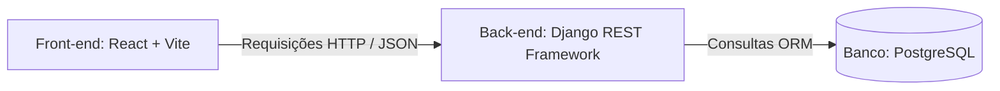

# Guia de Tecnologias e Arquitetura do Projeto

Este documento serve como um tutorial explicativo sobre a stack tecnológica adotada no **Sistema de Gestão de TCC e Bancas** (Módulo 2), detalhando a função de cada tecnologia, o motivo de sua escolha e as principais diretrizes arquiteturais que a equipe deve conhecer.

---

## 1. Visão Geral da Stack

O projeto utiliza uma arquitetura descentralizada (decoupled), na qual o **Front-end** e o **Back-end** são totalmente separados, comunicando-se exclusivamente através de requisições HTTP (API REST) e troca de dados no formato **JSON**.



---

## 2. Tecnologias do Front-end

### **React**
*   **O que é:** Uma biblioteca JavaScript de código aberto para a construção de interfaces de usuário baseadas em componentes.
*   **Por que foi usada:**
    *   **Componentização:** Permite dividir a tela em pequenos pedaços isolados e reutilizáveis (como o botão de cancelar, o cabeçalho do IFAM e o formulário), o que facilita a colaboração de uma equipe de 13 alunos.
    *   **Estado Declarativo (Hooks):** O uso de `useState` e `useEffect` permite que a tela reaja automaticamente quando dados são adicionados ou excluídos da API, sem precisarmos manipular o HTML diretamente.
    *   **Performance (Virtual DOM):** Atualiza na tela apenas a parte do código que realmente mudou, mantendo a navegação rápida.

### **Vite**
*   **O que é:** Um ferramenta de build (compilação) extremamente rápida para projetos modernos de front-end.
*   **Por que foi usada:**
    *   **Velocidade no Desenvolvimento:** Utiliza módulos ES nativos no navegador, fazendo com que o servidor de desenvolvimento inicie instantaneamente, ao contrário de ferramentas antigas como o *Create React App* (Webpack).
    *   **Hot Module Replacement (HMR):** Atualiza as alterações de código quase em tempo real no navegador sem perder o estado atual da página.
    *   **Otimização para Produção:** Gera arquivos CSS e JS minificados e otimizados automaticamente na pasta `dist/`.

### **React Router DOM**
*   **O que é:** A biblioteca padrão para gerenciamento de rotas e navegação em aplicações React.
*   **Por que foi usada:**
    *   **Single Page Application (SPA):** Permite mudar de "página" (ex: de bancas para temas) sem recarregar todo o site no navegador. Isso gera uma experiência fluida de aplicativo de mesa.
    *   **Controle de Rotas Privadas:** Permite bloquear certas páginas caso o usuário não esteja logado no sistema.

### **Axios**
*   **O que é:** Um cliente HTTP baseado em promessas para fazer requisições à API.
*   **Por que foi usada:**
    *   **Interceptadores de Requisição:** Permite injetar automaticamente o Token de Autenticação (`Bearer token`) no cabeçalho de todas as requisições enviadas ao Django.
    *   **Conversão Automática de Dados:** Transforma automaticamente o JSON recebido da API em objetos JavaScript prontos para uso.
    *   **Tratamento de Erros:** Facilita a captura de erros HTTP (como 400 Bad Request ou 401 Unauthorized).

---

## 3. Tecnologias do Back-end

### **Django & Django REST Framework (DRF)**
*   **O que é:** **Django** é um framework web Python de alto nível; o **DRF** é uma extensão poderosa para construir APIs Web baseadas no padrão REST.
*   **Por que foi usada:**
    *   **Desenvolvimento Rápido (Batteries-Included):** O Django já traz prontas ferramentas de segurança (contra SQL Injection, CSRF), estrutura de rotas e um painel administrativo automático.
    *   **Serializers do DRF:** Convertem de forma simples as tabelas do banco de dados (modelos Python) para JSON (e vice-versa), além de realizar a validação dos dados antes de salvá-los.
    *   **ORM robusto:** Permite interagir com o banco de dados escrevendo código Python (ex: `Banca.objects.all()`) ao invés de consultas SQL manuais.

### **Simple JWT**
*   **O que é:** Uma extensão do Django REST Framework para autenticação utilizando JSON Web Tokens.
*   **Por que foi usada:**
    *   **Autenticação Stateless (Sem estado):** O servidor de banco de dados não precisa guardar sessões ativas. O usuário recebe um token ao logar e o envia a cada requisição para provar sua identidade.
    *   **Segurança:** Utiliza chaves criptográficas para garantir que o token não seja adulterado.

### **Django CORS Headers**
*   **O que é:** Um pacote Django para gerenciar regras de CORS (Cross-Origin Resource Sharing).
*   **Por que foi usada:**
    *   **Permissão de Acesso:** Navegadores bloqueiam por padrão requisições vindas de portas diferentes (ex: React em `http://localhost:5173` chamando Django em `http://127.0.0.1:8000`). O CORS-Headers diz ao navegador que a API do Django confia no Front-end local e permite a comunicação.

---

## 4. Banco de Dados

### **PostgreSQL**
*   **O que é:** Um sistema de gerenciamento de banco de dados relacional de código aberto muito robusto.
*   **Por que foi usada:**
    *   **Confiabilidade (Transações ACID):** Garante a consistência dos dados acadêmicos mesmo se o servidor cair durante uma operação de gravação.
    *   **Suporte a UUIDs:** Utilizado para criar chaves primárias seguras de bancas e alunos (evitando IDs sequenciais previsíveis na URL).
    *   **Padrão de Mercado:** Integração perfeita com o Django em ambientes reais de produção.

---

## 5. Fluxos e Arquiteturas Importantes do Projeto

### **A. Fluxo de Autenticação com JWT**
1. O usuário digita usuário e senha no Front-end.
2. O Front-end envia via Axios para o endpoint `/api/token/`.
3. O Back-end valida e devolve dois tokens:
   *   **Access Token:** Token de curta duração (ex: 5 minutos) usado para autorizar requisições.
   *   **Refresh Token:** Token de longa duração usado para obter um novo *access token* sem deslogar o usuário.
4. O Front-end guarda o *access token* no `localStorage` e o injeta no cabeçalho das requisições via Axios Interceptor.

### **B. Estrutura de Pastas e Separação de Responsabilidades**

No **Front-end (React)**:
*   `src/components/`: Componentes visuais menores (botões, modais).
*   `src/pages/`: Páginas inteiras do sistema (ex: `AgendamentoBancaPage.jsx`).
*   `src/services/`: Códigos de comunicação com a API (ex: `agendamentoBanca.service.js`).

No **Back-end (Django)**:
*   `gestao_tcc/models.py`: Define o desenho das tabelas no banco de dados.
*   `gestao_tcc/serializers.py`: Controla o que entra e sai do formato JSON e valida os dados.
*   `gestao_tcc/views.py`: Contém a regra de negócio e os métodos da API (GET, POST, DELETE).
*   `backend/urls.py` e `gestao_tcc/urls.py`: Mapeiam os caminhos de URL da API.

---

## 6. Boas Práticas e Dicas para a Equipe

1.  **Migrações de Banco (Django):** Sempre que alterar o arquivo `models.py`, não se esqueça de rodar:
    ```bash
    python manage.py makemigrations
    python manage.py migrate
    ```
2.  **Variáveis de Ambiente:** Evite colocar senhas do banco de dados expostas diretamente no código público (`settings.py`). Use variáveis de ambiente (arquivo `.env`).
3.  **Acessibilidade e Design (IFAM/Gov.br):** As cores principais e o layout da tela foram alinhados às diretrizes do IFAM e do Governo Federal. Sempre que criar novos elementos, respeite a paleta de cores definida nas variáveis do arquivo `AgendamentoBancaPage.css` (`--verde-principal`, `--cor-verde-marca`, `--texto-principal`, etc.).
4.  **Serviço do Postgres no Windows:** Lembre-se de que o PostgreSQL roda como serviço do Windows. Se o seu computador estiver lento fora do horário de programação, você pode parar o serviço `postgresql-x64-XX` nos Serviços do Windows (`services.msc`) e alterá-lo para ativação **Manual**.
